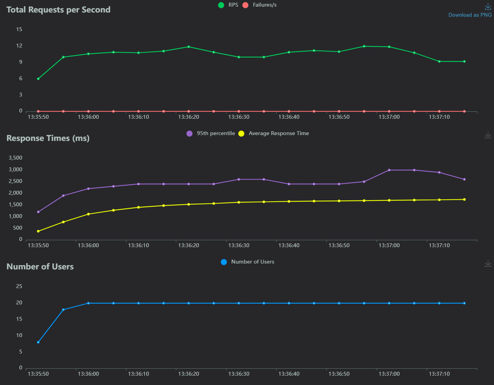
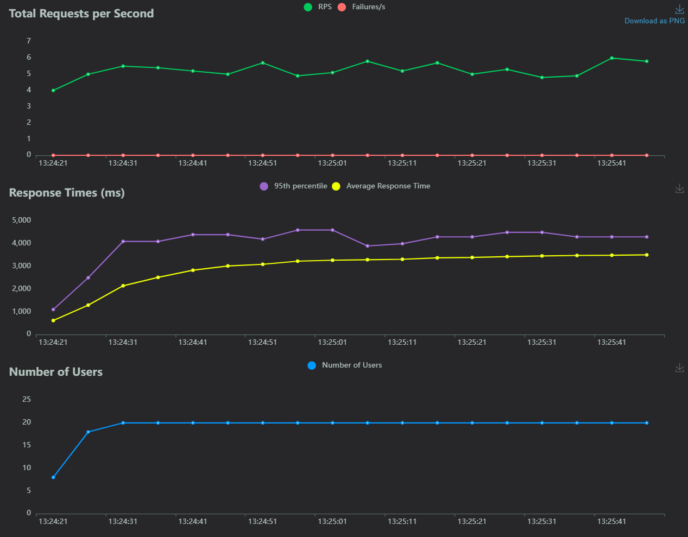
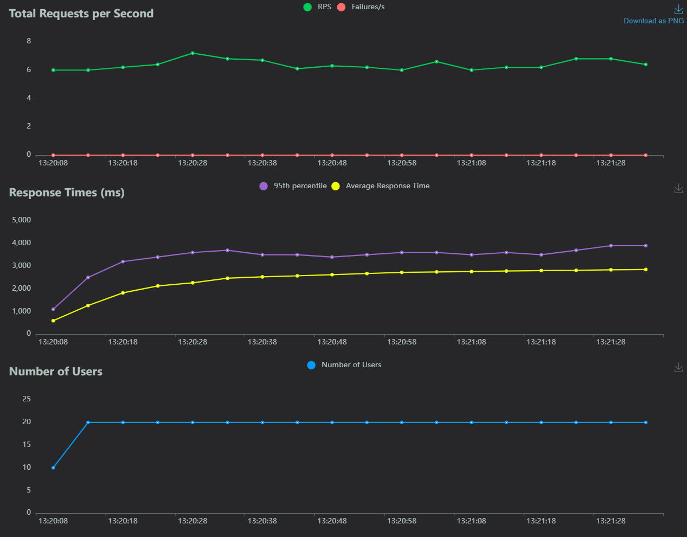

# 🏃‍♂️ Running Performance Tests

 Prerequisits: 

 1. Start the backend app 

Follow the steps below to run performance tests:

1. Navigate to the project's root directory.
2. Run the command `make perf-tests` in the console.
3. Than launch the Locust GUI at  🚀[http://localhost:8089](http://localhost:8089).
4. Fill in the data fields on the Locust welcome page. The default inputs are provided in the `locust.conf` configuration file, but you can modify these as needed. Confirm by clicking the 'START' button.

# Generating Mock Data

You can generate fake transaction data using a dedicated endpoint. This allows you to add a specified number of transactions to the database (a test database is recommended).

Use the following link to generate mock transactions: 
`http://localhost:8000/api/only_for_purpose/mock_transactions?count=100000&days_back=30`

- **count**: The number of transactions you want to add.
- **days_back**: The number of days in the past to start generating transaction dates from.

You can call this endpoint using Postman, Swagger docs at 
`http://localhost:8000/docs#/default/mock_transactions_api_only_for_purpose_mock_transactions_post`


Macos or Linux use curl: 

```bash
curl -X POST 'http://localhost:8000/api/only_for_purpose/mock_transactions?count=10&date_from=2024-03-01&date_to=2024-03-31'
```

Windows powershell terminal
```powershell
Invoke-WebRequest -Method POST -Body @{} -Uri "http://localhost:8000/api/only_for_purpose/mock_transactions?count=10&date_from=2023-09-01&date_to=2024-03-31" 
```


## Performance Test Results


### Test 1: 20 users, 1000 transactions 

During:
Test date: 2024-03-29 13:20:03 

Tested code commit: [df33567781bf489b039293345d38e4197f2532aa](https://github.com/PromptSail/prompt_sail/tree/df33567781bf489b039293345d38e4197f2532aa)

count=1000
date_from=2023-09-01
date_to=2024-03-31

```
curl -X POST 'http://localhost:8000/api/only_for_purpose/mock_transactions?count=1000&date_from=2023-09-01&date_to=2024-03-31'
```

```bash
locust --config locust.conf CountStatisticsUser
locust --config locust.conf CostStatisticsUser
locust --config locust.conf SpeedStatisticsUser
```


#add image.png from perf_tests folder


| Type Name | # Requests | # Fails | Median (ms) | Average (ms) | Min (ms) | Max (ms) | Average size (bytes) |
| --- | --- | --- | --- | --- | --- | --- | --- |
| GET /api/statistics/transactions_count?project_id=project-test&period=year | 244 | 0 | 1600 | 1704.73 | 103 | 2974 | 243 |
| GET /api/statistics/transactions_count?project_id=project-test&period=week | 207 | 0 | 1600 | 1704.86 | 113 | 3002 | 3598 |
| GET /api/statistics/transactions_count?project_id=project-test&period=month | 269 | 0 | 1600 | 1735.37 | 102 | 2964 | 834 |
| GET /api/statistics/transactions_count?project_id=project-test&period=day | 248 | 0 | 1800 | 1813.62 | 141 | 3000 | 24174 |
| **Aggregated** | 968 | 0 | 1600 | 1741.17 | 102 | 3002 | 7255.76 |
| GET /api/statistics/transactions_cost?project_id=project-test&period=year | 134 | 0 | 3700 | 3427.75 | 231 | 4511 | 2603 |
| GET /api/statistics/transactions_cost?project_id=project-test&period=month | 111 | 0 | 3700 | 3498.6 | 230 | 4511 | 9013 |
| GET /api/statistics/transactions_cost?project_id=project-test&period=week | 106 | 0 | 3700 | 3556 | 706 | 4327 | 39341 |
| GET /api/statistics/transactions_cost?project_id=project-test&period=day | 128 | 0 | 3800 | 3592.24 | 357 | 4573 | 264442 |
| **Aggregated** | 479 | 0 | 3700 | 3516.5 | 230 | 4573 | 82187.82 |
| GET /api/statistics/transactions_speed?project_id=project-test&period=month | 166 | 0 | 2800 | 2782.46 | 227 | 3877 | 7024 |
| GET /api/statistics/transactions_speed?project_id=project-test&period=year | 135 | 0 | 2800 | 2862.04 | 239 | 3888 | 2002 |
| GET /api/statistics/transactions_speed?project_id=project-test&period=week | 134 | 0 | 2800 | 2864.26 | 243 | 3878 | 29970 |
| GET /api/statistics/transactions_speed?project_id=project-test&period=day | 149 | 0 | 2800 | 2902.77 | 248 | 3886 | 183727 |
| Aggregated | 584 | 0 | 2800 | 2850.32 | 227 | 3888 | 56211.57 |


### Request per second and response time for /api/statistics/transactions_count



### Request per second and response time for /api/statistics/transactions_cost


### Request per second and response time for /api/statistics/transactions_speed

