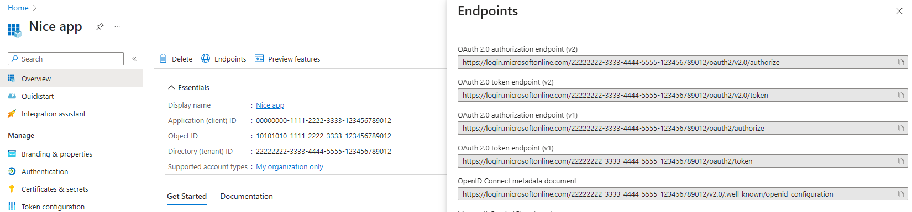
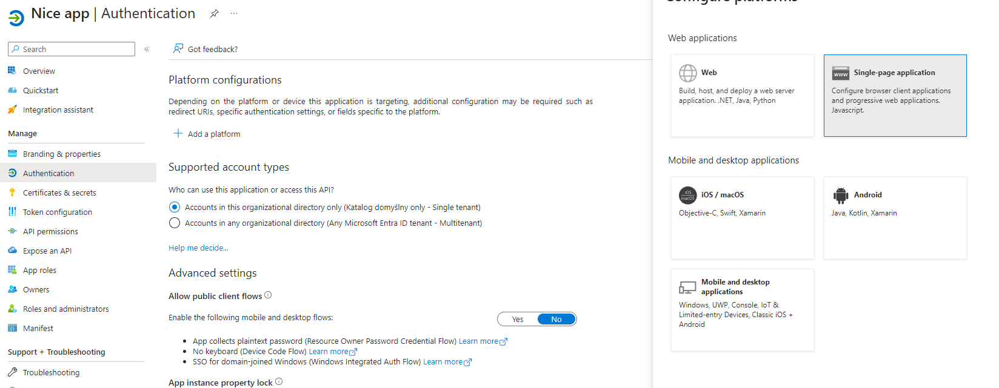

## Single Sign-On (SSO)

Single Sign-On (SSO) allows users to access multiple applications or services with a single set of login credentials. This means that users can log in once and gain access to all applications that are part of the SSO ecosystem without the need to log in separately to each application.

**You need to configure SSO parameters for at least one SSO Provider in `docker-compose` file to log in**

```
args:
    # Google
    SSO_GOOGLE_CLIENT_ID: '******.apps.googleusercontent.com'

    # Microsoft Azure
    SSO_AZURE_CLIENT_ID: '6fe*******'
    SSO_AZURE_TENANT: '4a1******'
    SSO_AZURE_SCOPES: 'user.read'
    SSO_AZURE_AUTHORITY: 'https://login.microsoftonline.com/4a1*****'
```

In the next steps I'll show you how it's done

-   ### SSO Google Configuration

    To make it work you need to replace `SSO_GOOGLE_CLIENT_ID` for yours **Client ID** and of course you need Google account. For more info about this process, visit the [Google Documentation](https://support.google.com/cloud/answer/6158849?hl=en&authuser=1&ref_topic=3473162&sjid=17476898588436060043-EU)

    1.  Go to [console.cloud.google.com](https://console.cloud.google.com/) (log in to your account where you will be performing the SSO configuration)
    2.  In the top left corner look for **Select a project** (this can also be the name of the current project), press it, then press on **NEW PROJECT** button. A form should open. Fill it as you want then press **CREATE** button

        
        <div style="text-align:center">
        
        </div>

    3.  Once created, easily press **SELECT PROJECT** in Notifications or select it via **Select a project**
    4.  You then need to go to **OAuth consenst screen**. You can easily type it in search bar and select it or look for it in the Quick access section

        

    5.  When you are there select User Type and press **CREATE**

        <div style="text-align:center">
        
        </div>

    6.  Next to do is fill the fields about your App information. Fill it as you want and press **SAVE AND CONTINUE**. The most important are **App name**, **User support email** and **Developer contact information**

        <div style="text-align:center">
        
        </div>

    7.  In next sections Scopes and Test users form is no need to fill anything. For promptasil app is unnecessary. Fill it as you want or scroll down and press **SAVE AND CONTINUE**.

        <div style="text-align:center">
        
        </div>

    Once you have gone through the whole form press **BACK TO DASHBOARD**. If you have not added any Test users, you need change **Publishing status** to **In production** by pressing **PUBLISH APP** in the **OAuth consenst screen** dashboard. The **Testing** status allows only users listed in Test users list to log in.

    <div style="text-align:center">
    
    </div>

    Now go to **Credentials** tab.

    1.  Press **CREATE CRENDETIALS** and choose **OAuth client ID**. The next form will open.

        <div style="text-align:center">
        
        </div>

    2.  In **Application Type** select **Web application** and you can enter any name you like.
    3.  Authorised JavaScript origins is **the most important configuration** in the whole proccess. It gives login access for provided URIs. Press **ADD URI** and type valid url where promptsail app will run. You could enter **internal or external URL**. Enter only hostname, without subpages. The default configuration is `http://localhost`. Remember to specify the port if it's other than 80, for example `http://localhost:5173`
    4.  Press **CREATE** button. No need to fill more information for now

        <div style="text-align:center">
        
        </div>

    The form will then close and a modal window will appear where you can find the **Client ID** (the same information can be found by selecting Credentials and pressing on the name of one of the **OAuth 2.0 Client IDs**).

    <div style="text-align:center">
    
    </div>

    Copy and paste it in value of `SSO_GOOGLE_CLIENT_ID` in `docker-compose` file

    <div style="text-align:center">
    
    </div>

-   ### SSO Microsoft Azure Configuration

    To make it work you need to replace `SSO_AZURE_CLIENT_ID`, `SSO_AZURE_TENANT`, `SSO_AZURE_SCOPES` and `SSO_AZURE_AUTHORITY`
    for yours values and of course you need Microsoft Azure account. For more info about this process, visit the [Microsoft Documentation](https://learn.microsoft.com/en-us/entra/identity/enterprise-apps/add-application-portal-setup-sso)

    1. Go to [portal.azure.com](https://portal.azure.com/)
    2. Enter to **Microsoft Entra ID**

        <div style="text-align:center">
        
        </div>

    3. Enter to **App registration**
    4. Press **New registration**

        <div style="text-align:center">
        
        </div>

    5. Fill the form like you want (you can leave **Redirect URI** blank. There will be more information on this in the next steps) and press **Register**

        <div style="text-align:center">
        
        </div>

    6. Go back to **Microsoft Entra ID** > **App registration**
    7. Find the app you created and press it

        <div style="text-align:center">
        
        </div>

    8. Here you will already have all the information you need to connect Azure SSO to promptsail app.

        <div style="text-align:center">
        
        </div>

        - set `SSO_AZURE_CLIENT_ID` to your **Application (client) ID**
        - set `SSO_AZURE_TENANT` to your **Directory (tenant) ID**
        - `SSO_AZURE_SCOPES` can be left unchanged. We only need the basic information about your account
        - `SSO_AZURE_AUTHORITY` is a URL made of two parts: a domain (aka instance), and a tenant identifier. It can be easily found by pressing **Endpoints** and pasting the first URL without `/oauth2/v2.0/authorize`
            <div style="text-align:center">
            
            </div>

    9. To get access login for promptsail app need to be added his login URL. Press **Add a Redirect URI**
    10. Press **Add a platform**
    11. Select **Single-page application**

        <div style="text-align:center">
        
        </div>

    12. Enter valid url where promptsail app will run. You could enter **internal or external URL**. Add to URL subpage `/signin`, where the login takes place. The default configuration is `http://localhost/signin`. Remember to specify the port if it's other than 80, for example `http://localhost:5173/signin`.
    13. Press **Configure**

        <div style="text-align:center">
        
        </div>

    14. You can add more redirected URLs by pressing **Add URI** in new section below **Add a platform** button

        <div style="text-align:center">
        
        </div>

    15. Press **Save**
    16. Now you can make neccessary changes in `docker-compose` which are describe ealier (if you not done it already) and then Microsoft Azure SSO will be work on promptsail app

        <div style="text-align:center">
        
        </div>
